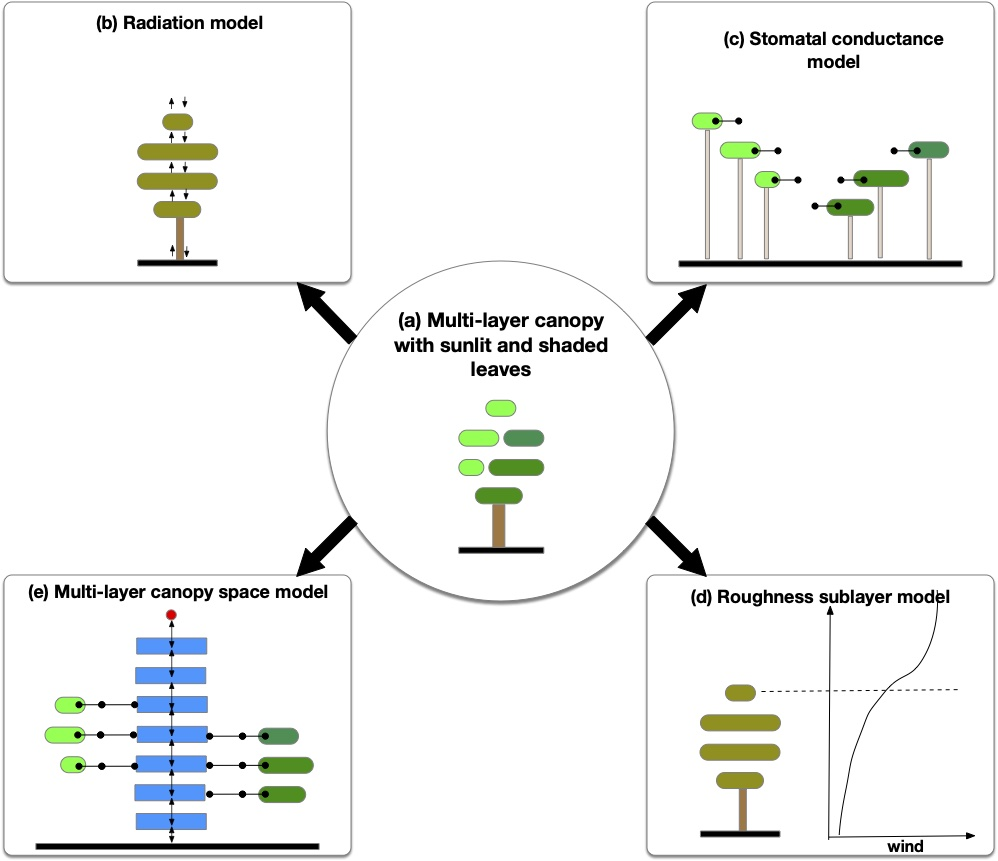

# Overview

The Multi-Layer Canopy Model version 1 (MLCMv1) for the Energy Exascale Earth System Model (E3SM)
Land Model (ELM) resolves the micro-climate created by the vegetation canopies. 
ELM-MLCMv1 is based on [CLM-ml v1](https://github.com/gbonan/CLM-ml_v1)[@bonan2021moving] and
uses [PETSc](https://petsc.org) to provide support for heterogeneous computing architectures.
The performance portability of the model has been studied on NVIDIA and AMD GPUs.
<!--and a speedup of 25-50 times has been shown on a GPU relative to a CPU.-->
The MLCMv1 has been benchmarked against the CLM-ml v1 for the Ameriflux US-Unversity of Michigan
Biological Station site. The equations describing the various physics in this technical guide are
based on previous publications[@bonan2018modeling,@bonan2019climate].

<figure markdown>
  
  <figcaption>
  Schematic representation of ELM-MLCMv1.
  </figcaption>
</figure>

The ELM-MLCMv1 accounts for sunlit (shown in light green) and shaded (shown in dark green) leaves at each canopy
level. The model includes the following four sub-models for:

1. shortwave and longwave radiation,
2. stomatal conductance,
3. roughness sublayer (RSL) parameterization, and
4. transport of heat and water vapor in the canopy air space (CAS).

The radiation model and RSL parameterization lump sunlit and
shaded leaves as one at each canopy layer, while the other two sub-models explicitly account
for sunlit and shaded leaves. Similar to [CLM-ml v1](https://github.com/gbonan/CLM-ml_v1)[@bonan2021moving],
it is assumed that water from the soil is transported to each leaf via unconnected xylems.
The vertical profiles of the leaf and stem of a plant are described using a beta distribution.